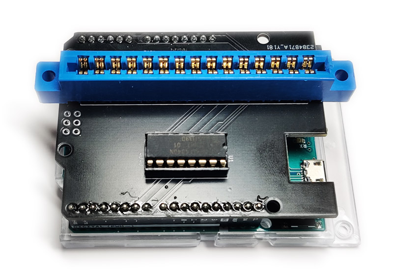
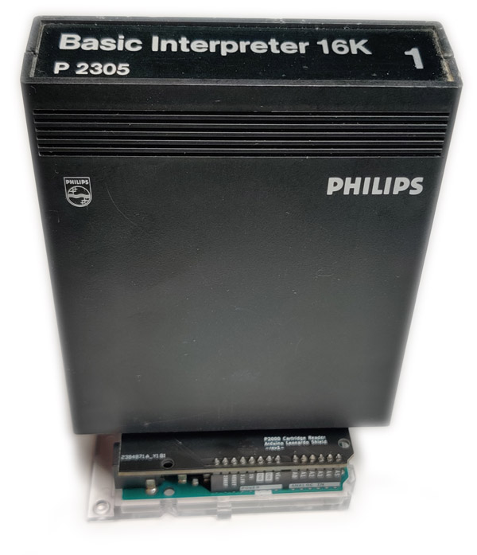

# P2000T Cartridge Reader

This repository contains hard- and software utilities to read P2000T cartridges
using an [Arduino Leonardo](https://docs.arduino.cc/hardware/leonardo) board.
The repository is organized as follows. The [arduino](arduino) folder contains
the source code for the Arduino Leonardo. In the [kicad](kicad) folder the
files can be found for the arduino shield board. Finally, in the [script](scripts)
folder a number of Python scripts can be found interfacing with the Arduino
Leonardo board to dump cartridge roms to a file.

## Kicad scheme

## Uploading the firmware

Open the [Arduino IDE](https://www.arduino.cc/en/software) and open the file
`cartridge_reader_firmware.ino`. Verify that the source code can be correctly
compiled and upload it to the Arduino Leonardo. Next, proceed to the Python
files as found below. Test that the interface is functioning and then use
the `readrom.py` file to dump the cartridges.

## Python files

The following three Python files are provided to interface with the Arduino
Leonardo Board. To work with these files, you need to have the
[pyserial](https://pypi.org/project/pyserial/) package installed.

* [serialtest.py](scripts/serialtest.py): Tests whether Python can succesfully
  interface with the Arduino Leonardo and the cartridge reader firmware.
* [comparison_test.py](scripts/comparison_test.py): Tests whether the standard
  basic cartridge can be succesfully read. This requires one to have such a
  cartridge in their possession.
* [readrom.py](scripts/readrom.py): Dumps the contents of the cartridge in
  a `rom.bin` file. The `rom.bin` file is stored in the same folder as where
  this file resides.

## Logic table

In the table below, the interfacing of the Arduino pins to the signals on the
P2000T cartridge can be found. This interfacing scheme has been designed
around the documentation as found [here](https://www.philips-p2000t.nl/cartridges/basic-cartridge).
**It should be explicitly mentioned that the scheme as found in the Field Support
Manual is erroneous and has the CARSEL1 (CS1) and CARSEL2 (CS2) pins swapped.**

| BANK | D8 / A12B | D2 / ~CS1 | D3 / ~CS2 | A12  | A13  | ~CS  |
|------|-----------|-----------|-----------|------|------|------|
|`0x00`| HIGH      | LOW       | HIGH      | LOW  | LOW  | LOW  |
|`0x01`| LOW       | LOW       | HIGH      | HIGH | LOW  | LOW  |
|`0x02`| HIGH      | HIGH      | LOW       | LOW  | HIGH | LOW  |
|`0x03`| LOW       | HIGH      | LOW       | HIGH | HIGH | LOW  |
| N/A  | x         | HIGH      | HIGH      | x    | x    | HIGH |

## Bill of materials

* Arduino Leonardo
* 2x15 pin edge connector; pitch 3.96mm
* 74HCT4040N or similar

## Picture

## Licensing

* All source code, i.e. the [firmware](arduino/cartridge_reader_firmware) and the Python [scripts](scripts)
  are released under a [GPLv3 license](https://www.gnu.org/licenses/gpl-3.0.html).
* The hardware files to (re)produce the Arduino board are released under the 
  [CC BY-SA 4.0](https://creativecommons.org/licenses/by-sa/4.0/) license.